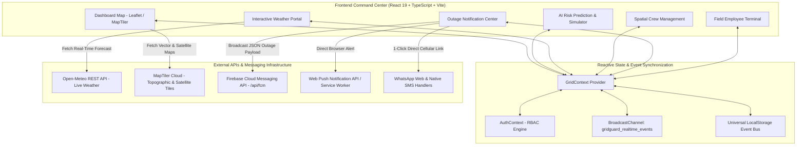

# Technical Architecture — GridGuard AI

## 1. System Architecture Diagram

---

## 2. Component Responsibility Matrix

| Component / File | Technology | Responsibility |
|---|---|---|
| [`src/context/GridContext.tsx`](file:///Users/shaandabhi/Documents/PROJECTS/Bob_hackathon/src/context/GridContext.tsx) | React Context, Web Audio API | Single source of truth for assets, crews, simulation parameters, and cross-tab event handling |
| [`src/context/AuthContext.tsx`](file:///Users/shaandabhi/Documents/PROJECTS/Bob_hackathon/src/context/AuthContext.tsx) | React Context, LocalStorage | Manages user authentication, employee rosters, and Role-Based Access Control (Admin vs. Employee vs. Testing) |
| [`src/services/weatherService.ts`](file:///Users/shaandabhi/Documents/PROJECTS/Bob_hackathon/src/services/weatherService.ts) | TypeScript, Fetch API | Asynchronously fetches live weather telemetry from Open-Meteo for Gujarat anchors |
| [`src/services/firebaseMessagingService.ts`](file:///Users/shaandabhi/Documents/PROJECTS/Bob_hackathon/src/services/firebaseMessagingService.ts) | TypeScript, Fetch API | Client service initiating POST requests to `/api/fcm` |
| [`api/fcm.js`](file:///Users/shaandabhi/Documents/PROJECTS/Bob_hackathon/api/fcm.js) | Node.js, Firebase Admin SDK | Serverless API route broadcasting emergency alerts to FCM topic `gridguard-outages` |
| [`src/components/dashboard/RealLeafletMap.tsx`](file:///Users/shaandabhi/Documents/PROJECTS/Bob_hackathon/src/components/dashboard/RealLeafletMap.tsx) | Leaflet, React Leaflet | Geospatial rendering of transmission lines, substations, storm hazard overlays, and routing trajectories |
| [`src/components/views/WeatherView.tsx`](file:///Users/shaandabhi/Documents/PROJECTS/Bob_hackathon/src/components/views/WeatherView.tsx) | React, CSS Grid | Interactive meteorological sliders, scenario presets, and real-time regional asset tables |
| [`src/components/views/CrewManagementView.tsx`](file:///Users/shaandabhi/Documents/PROJECTS/Bob_hackathon/src/components/views/CrewManagementView.tsx) | React, Lucide Icons | Algorithmic crew matching, availability guards, and employee dedicated work order portal |
| [`src/components/views/OutageNotificationsView.tsx`](file:///Users/shaandabhi/Documents/PROJECTS/Bob_hackathon/src/components/views/OutageNotificationsView.tsx) | React | Multi-channel broadcast dispatch, FCM destination transparency, and contact registry |
| [`src/components/common/RealtimeAlertBanner.tsx`](file:///Users/shaandabhi/Documents/PROJECTS/Bob_hackathon/src/components/common/RealtimeAlertBanner.tsx) | React, CSS Animation | Floating real-time alert banner displaying incoming dispatches with audible tone |

---

## 3. End-to-End Data Flow

1. **SCADA Ingestion & Weather Sync:**
   - Every second, SCADA sensor streams update winding temperatures, vibration patterns, and load percentages.
   - The weather service periodically queries the Open-Meteo REST API or processes interactive slider inputs.
2. **Dynamic Risk Assessment:**
   - The risk calculation engine evaluates:
     $$\text{Total Risk} = (0.40 \times \text{Sensor}) + (0.25 \times \text{Weather}) + (0.20 \times \text{History}) + (0.15 \times \text{Criticality})$$
   - Equipment with risk > 80% is escalated to `Critical` status.
3. **Crew Proximity Algorithm:**
   - For a critical asset, Haversine spherical geometry calculates the distance to all units staged across Gujarat depots:
     $$d = 2r \arcsin\left(\sqrt{\sin^2\left(\frac{\Delta \phi}{2}\right) + \cos(\phi_1)\cos(\phi_2)\sin^2\left(\frac{\Delta \lambda}{2}\right)}\right)$$
   - Only units with `status === 'Available'` are eligible for recommendation.
4. **Broadcast & Cross-Device Reflection:**
   - When Admin clicks **"Assign Crew"**, a structured JSON event is dispatched via `BroadcastChannel` and `localStorage`.
   - Employee tabs immediately play a 440Hz alert chime and pop up the work order acknowledgment banner.
   - Outage notifications transmit via `/api/fcm` to Firebase Cloud Messaging topic `gridguard-outages`.

---

## 4. Security & Compliance
- **Credential Segregation:** `.env` and `firebase-service-account.json` are excluded via `.gitignore`.
- **Role-Based Boundaries:** Non-admin accounts are restricted from accessing system settings, modifying model parameters, or initiating mass broadcasts.
